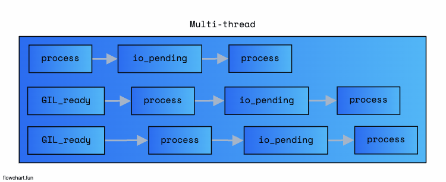
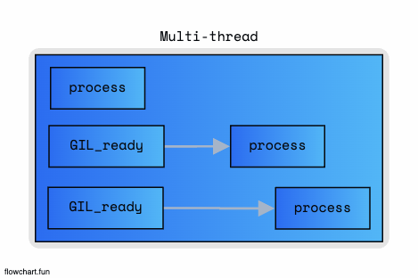
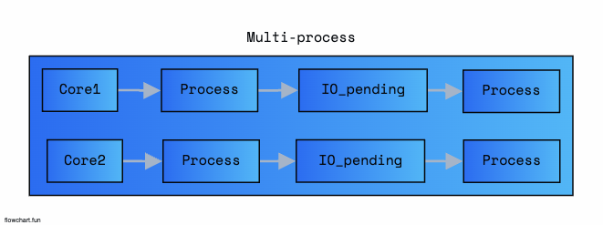
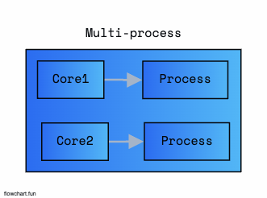

# parallelization use Python

## Desc

> Multi Threading + Multi Processing 기법

- Lock
  - 스레드들이 공유하는 데이터나 자원의 대한 접근을 제어
  - primitive 동기화 작업
- RLock
  - Lock 과 유사하나, 하나의 스레드가 이미 공유자원에 접근했을 경우, 해당 스레드의 접근 허용
  - 재귀적으로 Lock을 획득 가능
- Semaphore
  - 스레드의 공유자원의 접근 허용
  - 동시에 접근하느 개수를 정할 수 있음
- Queue
  - 작업 큐
  - 기본적인 Queue를 사용하게 되면 스레드에서 자동적으로 Lock이 구현 됨
- Event
  - 이벤트 발생 시 까지 스레드를 차단,
  - 이벤트 트리거의 의해 스레드를 Control
- Condition
  - 스레드가 일시 중단된 상태에서 다른 스레드가 조건 충족 시, 스레드가 다시 실행되도록 하는 기능 제공
- Barrier
  - 여러 스레드가 모여서 특정한 지점까지 실행됐을 때에만 다음 단계로 넘어가는 기능을 제공합니다.

## multi-thread Example

- thread.py
- deamon_thread.py
- live_thread.py
- timeout_thread.py
- lock_thread.py
- queue_thread.py
- condition_thread.py
- barrier_thread.py

## multi-process Example

- multi-process.py
- multi-process-pool.py
- multi-process-pool-map.py
- communication-process.py
- process-pipe.py
- process-value_array.py
- process-manager.py
- concurrent.py

## Async-Sync

- coroutin.py
- native-coroutin.py
- async-lock.py

### Multi Thread

> IO Bounded (파일 Read / Write )



> Cpu Bounded (수치계산)



- [장점]

  - I/O Bounded 처리 효과적
  - Multi process -> Multi thread 수를 증가시키기에 확장성이 좋음

- [단점]

  - GIL 대기가 존재 (for, while)
  - CPU Bounded 부적합

### Multi Process

> IO Bounded (파일 Read / Write )



> Cpu Bounded (수치계산)



- [장점]

  - GIL의 영향을 받지 않음

- [단점]
  - CPU의 코어수를 초과하는 병렬화는 불가능 (확장성 불가)
  - 프로세스간의 통신이 필요함

## Multi Threading & Multi Process Benchmark

```python

import concurrent.futures
import time

import requests
from bs4 import BeautifulSoup

def main(url):
    print(f"Scraping {url}...")

    res = requests.get(url, timeout=5)

    if res.status_code == 200:
        soup = BeautifulSoup(res.text, "html.parser")
        first_desc = soup.select_one("p").text
        print(first_desc)
    else:
        print(res.status_code)


if __name__ == "__main__":

    urls = ["https://example.com", "https://example.org", "https://example.net", "https://example.com",
            "https://example.org", "https://example.net", "https://example.com", "https://example.org", "https://example.net"]

    print("---------- first method (for) ----------")
    startTime = time.time()
    for url in urls:
        main(url)
    endTime = time.time() - startTime
    print("for time >> ", endTime)

    print("--------- seconds method (concurrent) ---------")
    startTime = time.time()
    with concurrent.futures.ThreadPoolExecutor() as executor:
        # map -> iterable
        r = list(executor.map(main, urls))
    endTime = time.time() - startTime
    print("concurrent time >> ", endTime)

  """
    // for time
    >> time : 5.035107...

    // concurrent.futures
    >> time : 0.621763...
  """
```

```python
import concurrent.futures
import os
import subprocess
import time

COUNT = 10000000
LARGE_TEXT = "leedonggyu " * COUNT


def cpu_bounded():
    i = 0
    while i < COUNT:
        i = i + 1 - 2 + 3 - 4 + 5

    return "done"


def io_bounded(file_name: str):
    with open(file_name, "w+") as fs:
        fs.write(LARGE_TEXT)
        fs.seek(0)
        # fs.read()

    subprocess.run(["rm", "-rf", file_name], check=False)
    return "done"


def main():
    """
        io bounded 같은 경우 multi-threading이 효과적
        cpu bounded 같은 경우 multi-processing이 효과적
    """

    # io bounded (not multi-threading)
    start = time.time()
    io_bounded("test_1.txt")
    io_bounded("test_2.txt")
    print("io bounded time >> ", time.time() - start)

    start = time.time()
    with concurrent.futures.ThreadPoolExecutor(max_workers=2) as exec:
        f1 = exec.submit(io_bounded, "test_1.txt")
        f2 = exec.submit(io_bounded, "test_2.txt")

        f1.result()
        f2.result()
    print("io bounded use multi-threading >> ", time.time() - start)

    # cpu bounded
    start = time.time()
    cpu_bounded()
    cpu_bounded()
    print("cpu bounded time >> ", time.time() - start)

    start = time.time()
    with concurrent.futures.ProcessPoolExecutor(max_workers=os.cpu_count()) as exec:
        f1 = exec.submit(cpu_bounded)
        f2 = exec.submit(cpu_bounded)

        f1.result()
        f2.result()
    print("cpu bounded use multi-process >> ", time.time() - start)


if __name__ == "__main__":
    main()

"""
io bounded time >>  0.10172605514526367
io bounded use multi-threading >>  0.10951805114746094
cpu bounded time >>  0.5273258686065674
cpu bounded use multi-process >>  0.34713220596313477
"""
```
